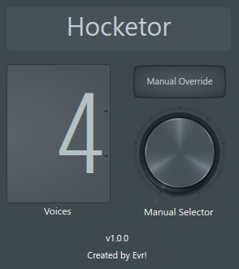
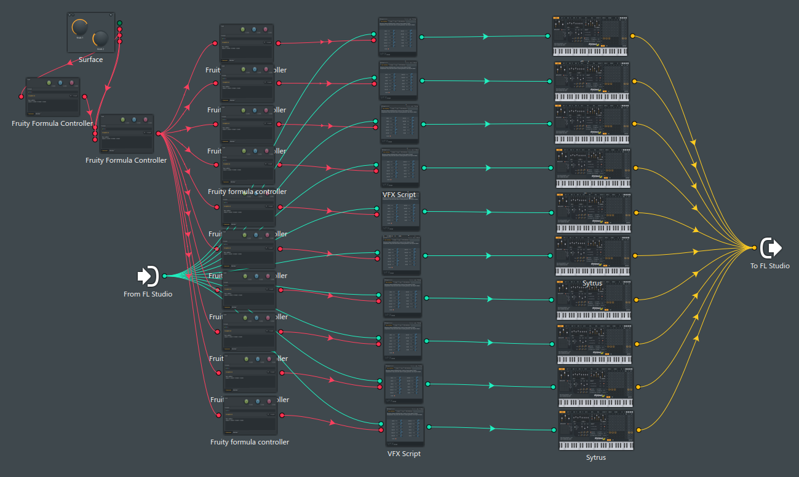

# Hocketor

A hocketing tool built within FL Studio Patcher. Splits the incoming MIDI notes across multiple different instruments. 

## Features
* **Random Selection:** Randomly cycles through up to 10 independent instrument voices.
* **Manual Selection:** Overrides the random cycle and allows for selection of specific voices.

## Controls

* `Voices`: The number of active voices being cycled through.
* `Manual Override`: A toggle switch. When engaged, the tool stops cycling automatically and stays on the voice selected by the `Manual Selector`.
* `Manual Selector`: A knob used to park the hocket on a specific instrument. 

## Signal Flow

## Installation

1. Download the latest preset file from this repository's Releases page.
2. If you are on Windows, copy the preset into:
	`Documents\Image-Line\FL Studio\Presets\Plugin presets\Generators\Patcher\`
3. Restart FL Studio (or refresh the Browser) so the preset appears in the Patcher generator presets list.

## Usage

1. Load the patcher preset into FL Studio Patcher.
2. Set `Voices` to choose how many instrument lanes are active.
3. Leave `Manual Override` off for automatic/random cycling, or turn it on and use `Manual Selector` to lock playback to one lane.
4. To use your own sound sources, replace the placeholder Sytrus instances in each lane with your preferred generators (for example FLEX, Harmor, Kontakt, or any VST/AU instrument).